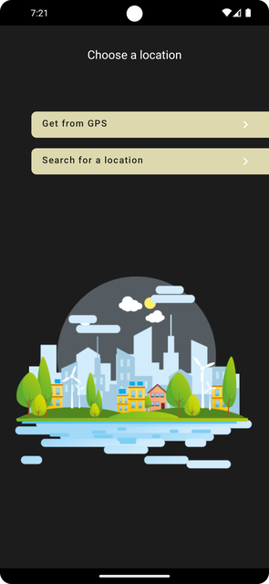
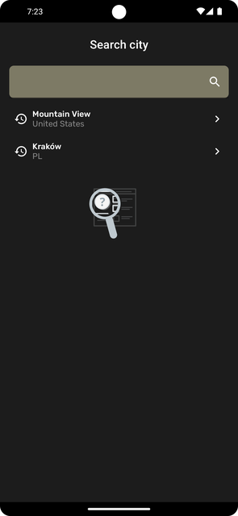
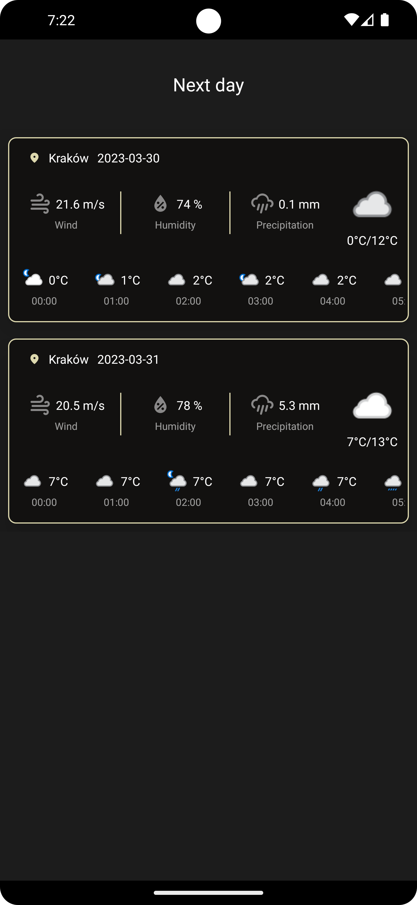
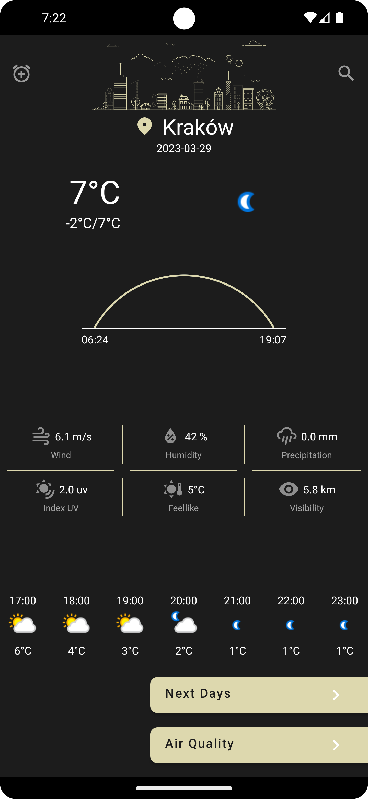
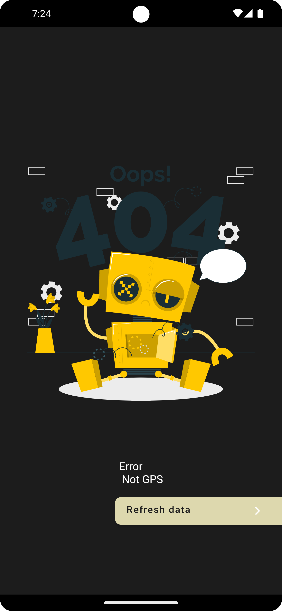

# Weather Application

Project using Clean Architecture + MVVM + Kotlin

# Use

* BroadcastReceiver
* AlarmManager
* ConnectivityManager
* CoroutineWorker

# Libraries Used

* Glide
* Navigation Component
* Compose
* Dagger Hilt
* Coroutines
* Flow
* Retrofit 
* Room
* Timber
* Lottie

# Screen
 &ensp; &ensp;  &ensp; &ensp;  &ensp; &ensp;  &ensp; &ensp; 

