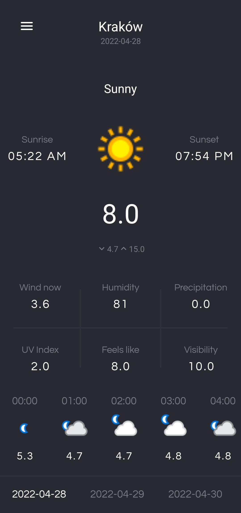

# Weather Application

Project using Cleean Architecture + MVVM + Kotlin

# Libraries Used

* Glide
* Navigation Component
* Dagger Hilt
* Coroutines
* Retrofit 
* Room
* Timber

# Screen
 &ensp; &ensp;  &ensp; &ensp; 

